# MotionLLM：SFT→RL、奖励建模与可信评估论文深读

> 范围：围绕当前工程中的 Qwen-VL Motion / Motion-R1、SFT、GRPO、Rubric 与 MCQ 评估链路，精选 12 篇最能转化为工程动作的论文。本文把论文明确分为三层：**训练优化直接相关**、**奖励/评审直接相关**、**评估治理直接相关**。所有数值均来自论文原文；历史 MotionLLM 结果不被混入任何“新主结果”。

## 先给结论：最值得立刻做的 8 件事

1. **把 GRPO 的“有效组比例”当作核心训练指标。** 当前二元 MCQ 奖励很容易产生全对组/全错组，组内方差为零后没有学习信号。MM-Eureka 的在线过滤与 VL-Rethinker 的选择性回放都在解决这个问题。
2. **把 VM/V 奖励从相关性 bonus 升级为反事实时序奖励。** 当前 `group_bonus_vm_v.py` 比较 VM 与 V 的组均正确率，只给 VM 正样本加分；Video-R1 的 T-GRPO 则对同一视频打乱帧序，直接测量“正确答案是否依赖时间顺序”，因果含义更清楚。
3. **不要用一个总 reward 掩盖组件失效。** 每步必须分别记录 exact answer、format、temporal counterfactual、rubric/judge、长度、KL，以及每个分量的零方差比例和与最终准确率的相关性。
4. **规则奖励与模型评审必须分层。** 可验证 MCQ 用严格规则奖励；开放解释、幻觉和推理质量用校准后的 rubric/judge。不要未经校准把 LLM judge 分数并入主准确率。
5. **PRM 先用于诊断与 Best-of-N，暂不直接做主训练奖励。** VisualPRM 表明逐步价值模型有效，但它的自动步骤标签本身有噪声；先做人标校准与错误定位，再决定是否进入 RL。
6. **主评估必须增加反事实四联表。** 至少同时报告 VM、V-only、文本/题目 only、帧序打乱；再做选项位置置换。这样才能区分“理解动作”与“记题、语言猜测、位置偏差”。
7. **开放式 Rubric 需要成对评审、位置交换和 tie 校准。** LLaVA-Critic 与 Prometheus 2 都说明：直接打分和 pairwise ranking 是不同任务，criterion 必须进入输入，且长度/位置/宽松打分偏差必须显式控制。
8. **每个新评估批次先完成所有 registry 模型的新鲜 finetune，再越过全局 barrier 评估。** 这是当前工作区的硬约束；论文中的历史 checkpoint、旧 prediction、forced-choice log-prob 或 proxy run 都只能作诊断，不得进入新主表。

## 当前代码对应关系与主要风险

当前 GRPO 配置使用 6 个采样、`beta=0.001`、option accuracy、format 与 VM/V bonus；配置文件名含 `lenreward`，但实际 reward 列表并未启用 length reward，运行名也写明 `nolengthreward`。这类“文件名—实际组件”不一致会污染实验解释，建议把每次运行解析后的 reward graph 写入 manifest。

`rewards_semantic_format.py` 已具备 `<think>...</think><answer>...</answer>` 的格式奖励和选项正确奖励；但主评估应使用更严格的单一 `<answer>[A-D]</answer>` 合同，任何 fallback 提取只能作为诊断。`group_bonus_vm_v.py` 当前判断 `vm_mean >= threshold * v_mean` 后，只对 VM 中正确样本加 bonus；它没有直接证明模型利用了运动顺序，也可能奖励数据难度差异。`rubric_rl/reward_v2.py` 已把活动、动作、时间、身体配置、数值运动学、左右、镜头、推理、语言、幻觉惩罚拆开，这是好基础；下一步是做人类一致性、judge 校准和分项消融。

---

## 第一层：训练优化直接相关

### 1. DeepSeekMath — GRPO 的原始算法与边界

- **论文**：[DeepSeekMath: Pushing the Limits of Mathematical Reasoning in Open Language Models](https://arxiv.org/abs/2402.03300)，2024-02-05，arXiv 预印本。
- **为什么是直接相关**：当前项目使用的就是 GRPO 范式；这篇论文给出了它相对 PPO 的资源优势、训练设置和关键消融。
- **核心机制**：不训练额外 value model；对同一问题采样一组输出，用组内奖励均值/标准差估计 advantage，并在目标中直接加入对 reference policy 的 KL 惩罚。它减少了 critic 占用，但也让训练信号高度依赖组内奖励方差。
- **数据与训练**：RL 使用约 14.4 万道来自 GSM8K/MATH 的 CoT 问题；每题采样 64 个输出，最大长度 1024，batch 1024，policy 学习率 `1e-6`，KL 系数 `0.04`。论文整体 SFT 语料约 77.6 万条。
- **关键结果**：7B Instruct→RL 的 GSM8K 从 82.9 到 88.2，MATH 从 46.8 到 51.7，CMATH 从 84.6 到 88.8。在线 RFT 优于离线 RFT，GRPO 又优于在线 RFT；过程监督优于只看结果。
- **真正重要的限制**：论文发现 RL 明显提高 Maj@K，却未提高 Pass@K，说明它更多是在重排已有解法分布，而不是创造新的基础能力。PRM 标签也可能有显著噪声。
- **对 MotionLLM 的 know-how**：
  - 记录 `nonzero_advantage_group_rate`，低于阈值时优先换采样/课程，而不是盲目增大训练步数。
  - MCQ 的答案 reward 可以继续规则化；推理链 reward 不宜用未经验证的单一神经 judge。
  - 同时看 Pass@K 与 Maj@K：若仅 Maj@K 上升，应把结论写成“分布更集中”，不要宣称出现新能力。
- **建议实验**：固定新鲜 SFT artifact，对 `G∈{4,6,8}`、温度、KL 做小网格；主对照同时报告有效组率、答案准确率、Pass@K、Maj@K。
- **主图**：Figure 4，PDF 第 13 页，PPO 与 GRPO 对比图。网页资产：`assets/figures/rl_deepseekmath.png`。来源：[原始 PDF](https://arxiv.org/pdf/2402.03300)。裁图应保留 PPO/GRPO 两列和图注。

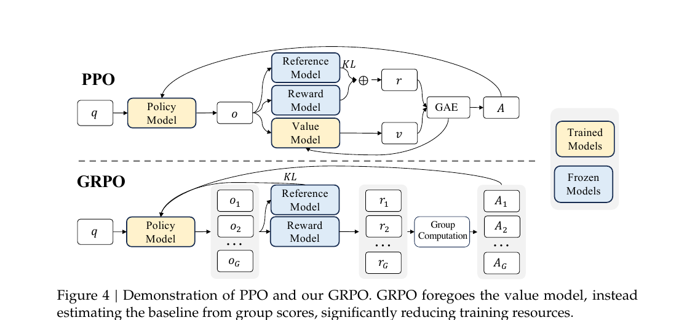

### 2. DeepSeek-R1 — 可验证奖励、冷启动与多阶段 RL

- **论文**：[DeepSeek-R1: Incentivizing Reasoning Capability in LLMs via Reinforcement Learning](https://arxiv.org/abs/2501.12948)，2025-01-22，arXiv 预印本。
- **为什么是直接相关**：它最清楚地区分了纯规则 RL、冷启动 SFT、推理 RL、拒绝采样再 SFT、通用偏好 RL 的职责。
- **核心机制**：R1-Zero 只使用准确性和格式两类规则奖励，不依赖神经 ORM/PRM；正式 R1 先用少量高质量冷启动 CoT，再做推理 RL，然后用拒绝采样构造新的推理与通用 SFT 数据，最后进行混合规则/模型奖励的第二阶段 RL。
- **训练事实**：R1-Zero 每题 16 个输出，温度 1，`beta=0.001`；最大长度先 32768，后 65536；总计约 10400 步。论文明确说明非可验证通用任务上的 model reward 容易被攻击，因此第二阶段把通用偏好 RL 放在后段。
- **关键结果**：R1-Zero 在 AIME 2024 的训练过程从 15.6 提升至 77.9，cons@16 达 86.7；正式 R1 报告 AIME 2024 79.8、MATH-500 97.3、LiveCodeBench 65.9。
- **限制**：工具使用、结构化输出、过度思考、语言混杂与 prompt 敏感仍存在；few-shot 反而可能伤害表现。不可验证任务上的 reward hacking 没有被根治。
- **对 MotionLLM 的 know-how**：
  - 把可验证动作 MCQ 与开放描述分成两条训练线。前者 rule-RL；后者先由 rubric 数据做 SFT/偏好学习，再谨慎 RL。
  - 冷启动样本应短而格式稳定，不能用超长 CoT 掩盖视觉/运动证据不足。
  - `<answer>` 严格格式可保留，但 format reward 权重应小于 correctness，避免“格式学得快、内容没提升”。
- **建议实验**：用同一个 fresh SFT artifact 比较 `accuracy only`、`accuracy+format`、`accuracy+format+temporal counterfactual`；每个分量单独画学习曲线和 reward-hacking 样例。
- **主图**：Figure 2，PDF 第 6 页，多阶段训练流水线。网页资产：`assets/figures/rl_deepseek_r1.png`。来源：[原始 PDF](https://arxiv.org/pdf/2501.12948)。

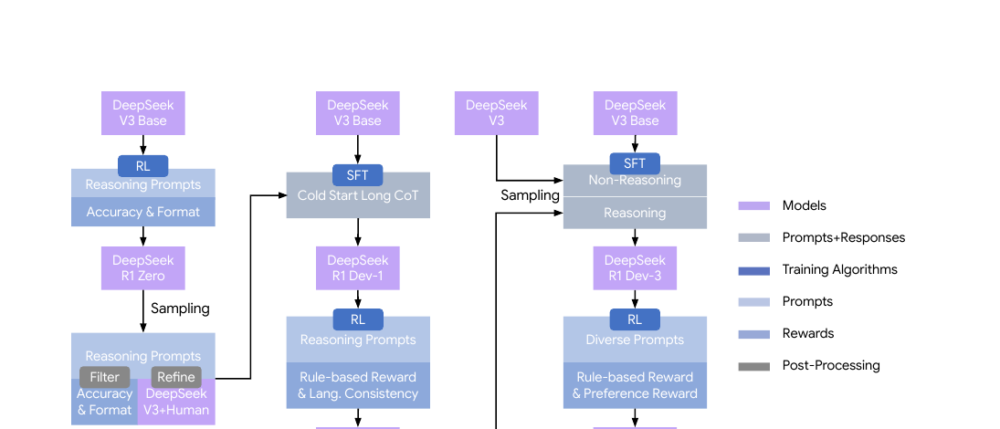

### 3. Video-R1 — 把“时间顺序依赖”写进 GRPO

- **论文**：[Video-R1: Reinforcing Video Reasoning in MLLMs](https://arxiv.org/abs/2503.21776)，2025-03-27，arXiv 预印本。
- **为什么是直接相关**：它是与 MotionLLM 最接近的训练设计：视频、多模态推理、规则 reward、GRPO，并显式构造时间反事实。
- **核心机制**：T-GRPO 对同一视频建立两组 rollout：原始有序帧与随机打乱帧。若有序组正确率不低于打乱组，则只给有序组中的正确输出额外 temporal bonus（论文使用 `α=0.3`），再做组内归一化。它把“是否依赖时间顺序”变成可测信号。
- **数据与训练**：Video-R1-260K 含约 11.6 万通用视频、1.5 万通用图像、图表/OCR/数学/知识/空间数据；先对约 16.5 万 CoT 样本 SFT，再用 Qwen2.5-VL-7B-Instruct 做 1000 步 T-GRPO。每题原始帧采样 8 个输出，打乱帧组约为一半；训练最多 16 帧。
- **关键结果**：64 帧测试时报告 VSI 37.1、VideoMMMU 52.4、MMVU 63.8、MVBench 64.8、TempCompass 73.2、Video-MME 无字幕 61.4。16 帧消融中，完整 T-GRPO 的 MVBench 62.7，高于不含 temporal reward 的 61.1。
- **限制**：训练只有 16 帧，反事实组增加推理成本；“随机打乱”只测顺序敏感，不一定等价于真实动作理解；任务 reward 仍是手工按数据集定义；固定 320–512 token 的长度 bonus 也可能被投机。
- **对 MotionLLM 的 know-how**：
  - 用同一 motion token 序列构造 `ordered / shuffled / reversed / frozen-middle` 四种反事实，比现有 VM/V 组均值更接近因果验证。
  - temporal bonus 必须只在基础答案正确时生效，否则会奖励“顺序敏感但答案错误”。
  - 记录每种反事实的正确率差和置信区间，不把 bonus 本身当评估指标。
- **建议实验**：先离线计算现有模型的 ordered-shuffled margin，再决定是否进入 RL；若 margin 对动作类别高度不均衡，应按动作类别分层采样。
- **主图**：Figure 3，PDF 第 5 页，T-GRPO 算法图。网页资产：`assets/figures/rl_video_r1.png`。来源：[原始 PDF](https://arxiv.org/pdf/2503.21776)。

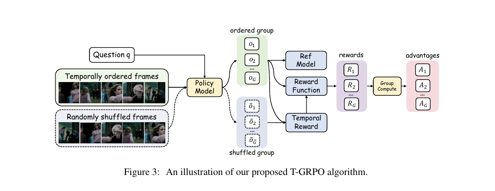

### 4. VLM-R1 — 规则奖励的可泛化设计与 reward hacking

- **论文**：[VLM-R1: A Stable and Generalizable R1-style Large Vision-Language Model](https://arxiv.org/abs/2504.07615)，2025-04-10，arXiv 预印本；[官方代码](https://github.com/om-ai-lab/VLM-R1)。
- **为什么是直接相关**：它展示了如何为不同视觉任务写可验证 reward，并直接报告了“朴素指标被模型投机”的案例。
- **核心机制**：指代表达用 IoU+格式奖励；开放词汇检测把 reward 写成 `min(1, L_gt/L_pred) × mAP`，通过长度校正抑制重复预测、预测所有类别等投机行为。
- **数据与训练**：基于 Qwen2.5-VL-3B，也扩展到 7B/32B；每题 8 个输出，温度 0.9，SFT/RL 学习率 `1e-6`，REC 使用 `beta=0.04`，OVD 使用 `beta=0`，训练 2 个 epoch。
- **关键结果**：LISA-Grounding 上 RL 63.14，高于 SFT 54.82；COCO 过滤设置下 mAP 21.1，高于 SFT 18.5；OVDEval 上 3B RL 31.01，高于 SFT 26.50。
- **限制**：结果集中在 grounding/detection，不能直接外推到长视频；细粒度和小目标仍弱；不同 reward 的尺度与 precision-recall 取舍依旧依赖手工设计。
- **对 MotionLLM 的 know-how**：
  - 当前 format、option、VM/V bonus 也需要“最小充分输出”约束，防止模型在 `<answer>` 周围堆叠多个候选或无关证据。
  - 对每个 reward 做 adversarial unit test：重复答案、答案泄漏、空 think、超长 think、多个 answer tag、全选项枚举。
  - 训练日志必须保存解析前原文与解析后结构；只保存最终 A-D 会掩盖 reward hacking。
- **建议实验**：建立 30–50 条 reward 红队用例，CI 中验证 reward 单调性和严格解析，再开始新 RL batch。
- **主图**：Figure 2，PDF 第 4 页，VLM-R1 框架与可插拔 reward 流程。网页资产：`assets/figures/rl_vlm_r1.png`。来源：[原始 PDF](https://arxiv.org/pdf/2504.07615)。

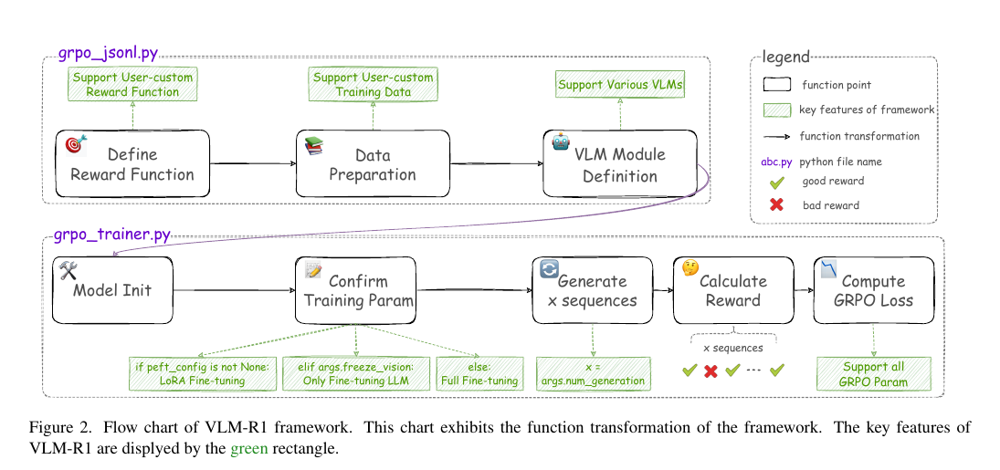

### 5. MM-Eureka — 在线过滤、两阶段 RL 与域回退修复

- **论文**：[MM-Eureka: Exploring Visual Aha Moment with Rule-based Large-scale Reinforcement Learning](https://arxiv.org/abs/2503.07365)，2025-03-10，arXiv 预印本；[官方代码](https://github.com/ModalMinds/MM-EUREKA)。
- **为什么是直接相关**：它提供了二元规则 reward 下“无有效 advantage 样本”的工程解法，并展示单域 RL 造成回退后如何补救。
- **核心机制**：正确答案由 Math-Verify 判定，格式奖励要求 `<think><answer>`；在线过滤掉组内全对/全错样本，仅训练存在有效相对信号的组。32B 训练分两阶段：先在 MMK12 上无 KL 强化，再加入少量 Geo3K 与很小 KL 修复几何域回退。
- **数据与训练**：MMK12 训练集 15,616 条可验证填空题，评估集 2,000 条 MCQ；每题 8 个 rollout，rollout/train batch 128，温度 1。论文 7B/32B 均基于 Qwen2.5-VL。
- **关键结果**：7B 消融平均分从 base 53.5、SFT 57.7、CoT-SFT 57.1 提升到 RL 64.5；32B 报告 MathVista 74.8、MathVerse 56.5、MathVision 34.4、WeMath 73.4。
- **限制**：训练域仍以视觉数学为主；o1 只抽测 500 条，比较不完全对称；规则验证器无法覆盖开放描述；阶段一确实造成几何域回退，说明“平均 reward 上升”不等于多域稳定。
- **对 MotionLLM 的 know-how**：
  - 在 batch sampler 中优先采样当前模型成功率位于挑战带的题目，而不是训练后才丢弃全对/全错组。
  - 新增“动作类别/运动来源/长度区间”分域回归面板，任何子域显著下降都阻止 promotion。
  - KL 不是越小越好；应由遗忘和格式漂移共同决定。
- **建议实验**：实现有效组 buffer，并比较“直接丢弃、按有效组重采样、选择性回放”三种策略的样本效率与偏差。
- **主图**：Figure 1，PDF 第 2 页，MMK12 与 MM-Eureka 总览。网页资产：`assets/figures/rl_mm_eureka.png`。来源：[原始 PDF](https://arxiv.org/pdf/2503.07365)。

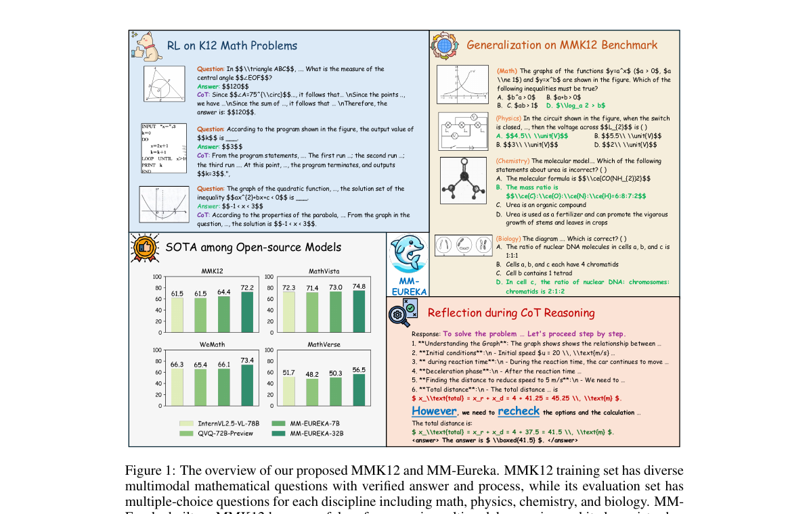

### 6. VL-Rethinker — 选择性样本回放与受控自我反思

- **论文**：[VL-Rethinker: Incentivizing Self-Reflection of Vision-Language Models with Reinforcement Learning](https://arxiv.org/abs/2504.08837)，2025-04-10，arXiv 预印本。
- **为什么是直接相关**：它直接针对 GRPO 二元 reward 的 vanishing advantage，并给出回放与“强制再思考”结合的训练方式。
- **核心机制**：Selective Sample Replay（SSR）只缓存非零 advantage 轨迹，并按 `|A|^α` 优先回放；强制再思考在首轮答案后追加自检/纠错/质疑触发词，仅保留最终答对的再思考轨迹，并增加 SFT loss。
- **数据与训练**：38,870 条可验证视觉数学/科学题；每题 8 个输出，batch 512 个 query-response pair，最多 3 epoch，模型每 1024 个 query 同步一次；每题最多保留 2 条正确 rethink 轨迹。
- **关键结果**：7B 报告 MathVista 74.9、MathVerse 54.2、MathVision 32.3、MMMU-Pro 41.7、EMMA 29.7。MathVision 消融：普通 GRPO 26.0，过滤 28.5，SSR 无 forced 29.8，完整方法 32.3。
- **限制**：回放带来轻微 off-policy 风险；人工 trigger 改变模型自然分布；只保留最终正确的 rethink 可能形成选择偏差；证据主要仍来自可验证数学/科学任务。
- **对 MotionLLM 的 know-how**：
  - motion QA 可把“先答—检查时序证据—修正”做成受控训练数据，但评估时不能强制同一 trigger，否则会高估能力。
  - replay buffer 应随 policy 同步周期清空或标记版本，避免旧 policy 轨迹长期污染。
  - 回放优先级除 `|A|` 外应加入动作类别稀缺度，避免只学习高频容易形成差异的题。
- **建议实验**：把 SSR 作为 sampler 插件，不修改基础 reward；先比较 wall-clock、有效组率和跨域遗忘，再决定是否引入 forced rethink。
- **主图**：Figure 4，PDF 第 5 页，SSR 与 forced rethinking 两阶段方法。网页资产：`assets/figures/rl_vl_rethinker.png`。来源：[原始 PDF](https://arxiv.org/pdf/2504.08837)。

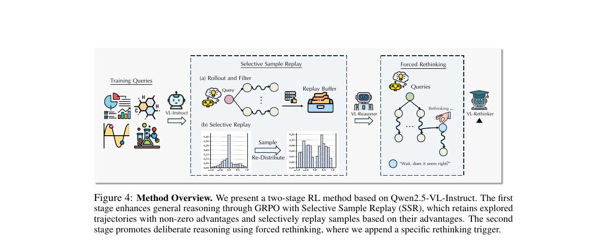

---

## 第二层：奖励模型与评审器直接相关

### 7. LLaVA-Critic — 多模态 pointwise/pairwise judge 与迭代 DPO

- **论文**：[LLaVA-Critic: Learning to Evaluate Multimodal Models](https://arxiv.org/abs/2410.02712)，2024-10-03，arXiv 预印本。
- **定位**：为图文回答训练专用 critic，既做绝对打分，也做成对偏好；与 MotionLLM 的 rubric evaluator 最接近。
- **数据与训练**：LLaVA-Critic-113K 包含约 4.6 万图像、11.3 万样本。pointwise 部分由 18,915 个 image-QA pair 扩展到 72,782 条评分样本；pairwise 约 40.1K，混合 score-gap、tie、人类 RLHF 与 RLHF-V 偏好。GPT-4o 生成部分评分理由。LLaVA-OneVision-7B/72B 训练 1 epoch，学习率 `2e-6`，batch 32。
- **机制**：pointwise 输入图像、问题、回答、可选参考答案、criteria，输出分数与理由；pairwise 同时输入两个回答，输出比较理由和胜者。迭代 DPO 每轮从 5 个候选中用 critic 选优劣，连续 3 轮刷新偏好数据。
- **关键结果**：pointwise 平均 Pearson：7B 0.732、72B 0.754；人类 pairwise 上 72B 的 no-tie accuracy 0.736、含 tie accuracy 0.605。迭代 DPO 在 LLaVA-W 上提升 10.1，LLaVA-Wilder 提升 3.0，WildVision 提升 8.8。
- **限制**：大量监督蒸馏自 GPT-4o，judge 偏差会被继承；“与人类相关”不等于事实正确；tie 明显更难；训练数据偏图像和 benchmark 风格，不能直接证明对 motion token 稳健。
- **对 MotionLLM 的 know-how**：
  - rubric judge 同时保留 pointwise 与 pairwise 头；pairwise 做 A/B 位置交换，只有两次一致才判胜，否则 tie/uncertain。
  - 对每个 rubric 维度单独校准，不只校准总分；优先看与人类的 Spearman/Pearson、加权 κ 和 error slice。
  - judge 输出不得直接替代 strict MCQ accuracy；它适合解释质量、幻觉与开放描述。
- **建议实验**：从当前 rubric 每个维度抽取正/负/边界样例，人类双标+仲裁，建立 300–500 条 motion judge calibration set。
- **主图**：Figure 1，PDF 第 4 页，LLaVA-Critic-113K 的 pointwise/pairwise 数据构成。网页资产：`assets/figures/rl_llava_critic.png`。来源：[原始 PDF](https://arxiv.org/pdf/2410.02712)。

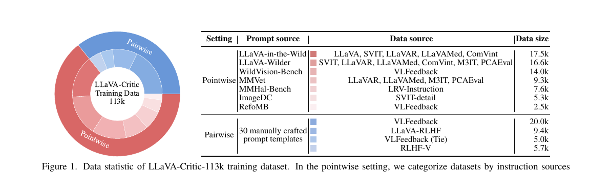

### 8. Prometheus 2 — criterion-conditioned 直接评分与成对排序

- **论文**：[Prometheus 2: An Open Source Language Model Specialized in Evaluating Other Language Models](https://arxiv.org/abs/2405.01535)，2024-05-02，arXiv 预印本；[官方代码](https://github.com/prometheus-eval/prometheus-eval)。
- **定位**：不是多模态模型，但它对 rubric 工程最有借鉴价值：评价标准必须是输入，直接评分与 pairwise 是不同技能。
- **机制与数据**：direct assessment 输入 instruction、response、reference answer、criterion/score rubric，输出反馈和 1–5 分；pairwise 输入两个回答和 criterion，输出比较反馈与胜者。共享约 1,000 条 criteria、2 万 instruction/reference；direct 约 10 万，pairwise 约 20 万。论文分别训练两种 evaluator 后再合并权重。
- **训练事实**：7B 模型最大长度 4096、学习率 `1e-5`；8x7B 使用 LoRA（`r=256, alpha=512, dropout=0.1`）并以 DARE 合并 direct/pairwise 模型。论文报告约 800 A100 GPU 小时。
- **关键结果**：Prometheus-2-8x7B 在 FLASK 与人类评分 Pearson 0.555（GPT-4 为 0.679）；HHH pairwise 平均 85.52，MT-Bench no-tie 71.96，Auto-J no-tie 79.98，Preference Bench 90.65。
- **限制**：相似的人类/强模型偏好不等于真实性；绝对 1–5 与二元比较粒度有限；英文偏好数据占主导；模型合并有效但机理并未完全解释。
- **对 MotionLLM 的 know-how**：
  - 当前 rubric 的 `global activity/basic action/temporal/body/numeric/laterality/camera/reasoning/language/hallucination` 应以 criterion ID 和版本号进入 judge 输入。
  - direct 用于分项诊断，pairwise 用于模型/检查点选择；二者不要混成同一个未校准总分。
  - reference answer 不能只有选项字母，应包含最小可核验证据；否则 judge 会奖励语言而不是 motion grounding。
- **建议实验**：先训练/提示一个 pairwise rubric judge，只用于盲评 fresh artifacts；做 A/B 对调、回答长度匹配、tie 阈值和人类一致性校准。
- **主图**：Figure 2，PDF 第 4 页，direct assessment 与 pairwise ranking 对比。网页资产：`assets/figures/rl_prometheus2.png`。来源：[原始 PDF](https://arxiv.org/pdf/2405.01535)。

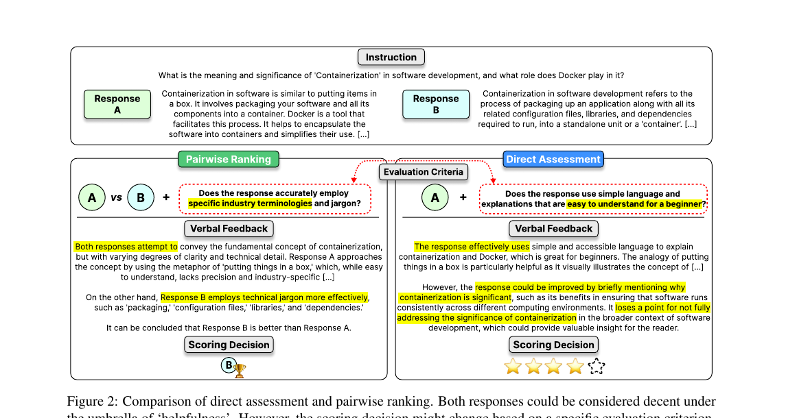

### 9. VisualPRM — 多模态逐步价值模型与 Best-of-N

- **论文**：[VisualPRM: An Effective Process Reward Model for Multimodal Reasoning](https://arxiv.org/abs/2503.10291)，2025-03-13，arXiv 预印本；[官方项目页](https://internvl.github.io/blog/2025-03-13-VisualPRM/)。
- **定位**：回答“是否值得给每个 reasoning step 打分”，并提供了人类逐步错误 benchmark。
- **核心机制**：VisualPRM400K 对每个中间步骤采样 16 个 continuation，以最终正确比例估计该步骤的 expected accuracy。value-based PRM 把 `mc_i>0` 视为正类；advantage-based PRM 则预测相对前一步的改善/持平/退化。推理时把各步分数平均为回答分数。
- **数据与训练**：每个 image-question 采样 4 条解答，每条最多 12 步，最终约 40 万样本、200 万步骤，平均 5.6 步，约 10% 为错误步骤。训练 1 epoch，AdamW，学习率 `1e-5`、weight decay 0.05、5% warmup 后 cosine decay。VisualProcessBench 含 2,866 条解答、26,950 个人工步骤标签，其中 7,691 错误、2,674 neutral。
- **关键结果**：Best-of-8 下，Qwen2.5-VL-7B 总平均从 41.4 到 45.1；InternVL2.5-8B 从 32.8 到 41.2；InternVL2.5-78B 从 46.0 到 51.9。VisualProcessBench 上 VisualPRM 总 F1 62.0，高于 GPT-4o 的 60.3。消融显示 value-based、监督所有步骤、平均聚合优于 advantage-based、首错即停、max 聚合。
- **限制**：自动 continuation 标签有噪声且正负不平衡；`mc_i>0` 是很宽松的正类；结果主要来自视觉数学推理；PRM 在 Best-of-N 上的收益也可能来自候选重排，不等于 policy 本身提升。
- **对 MotionLLM 的 know-how**：
  - 先把 PRM 用作“哪一步开始失去动作/时序证据”的诊断器和 BoN reranker，不立即混入主 RL reward。
  - motion reasoning 的步骤标签应包含 evidence source：V、M、VM、数值运动学、左右/镜头；neutral 必须单列。
  - 人工集使用 macro-F1/每类召回，不能被“多数步骤都正确”的 accuracy 欺骗。
- **建议实验**：建立 100 条、每条 3–8 步的 motion process set；双人标注每步 `correct/incorrect/neutral + source`，先测现有 rubric judge 的错误召回。
- **主图**：Figure 3，PDF 第 4 页，value-based 与 advantage-based PRM 建模方式。网页资产：`assets/figures/rl_visualprm.png`。来源：[原始 PDF](https://arxiv.org/pdf/2503.10291)。

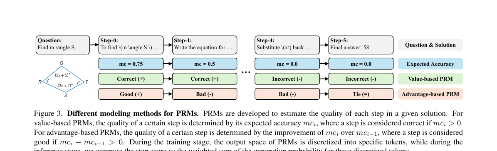

---

## 第三层：评估治理直接相关

### 10. MVBench — 20 类时间理解任务与静态→动态构造

- **论文**：[MVBench: A Comprehensive Multi-modal Video Understanding Benchmark](https://arxiv.org/abs/2311.17005)，2023-11-28，arXiv 预印本；[官方仓库](https://github.com/OpenGVLab/Ask-Anything)。
- **定位**：用于拆解 MotionLLM 到底在动作顺序、预测、计数、状态变化、姿态、交互还是反事实上进步。
- **构造方法**：从 11 个公开视频数据集与高质量标注出发，把静态视觉能力定义改造成 20 个必须依赖时间的任务；过滤过短/过长视频，主要保留 5–35 秒；ChatGPT 或模板把标注转换为 MCQ，选项随机打乱并检查长度，最终每任务 200 题、共约 4,000 题。
- **任务覆盖**：动作顺序/预测/反义/细粒度/意外动作，对象存在/交互/遮挡后位置，移动方向、动作定位、场景转换、动作/物体计数、状态变化、细粒度姿态、字符顺序、导航、情节推理、反事实。
- **关键结果**：原论文 VideoChat2 平均 51.1，明显高于同期视频模型；GPT-4V 16 帧设置为 43.5。消融显示视觉编码器、视频 instruction data 和可学习视觉模块比单纯换大 LLM 更关键。
- **限制**：复用公开数据有潜在训练重叠；自动 QA 可能带模板痕迹；固定抽帧会漏掉关键瞬间；部分任务（如 TVQA）仅视觉并不充分；原始 leaderboard 已有时代性。
- **对 MotionLLM 的 know-how**：
  - 不直接抄总分，按 20 类建立能力矩阵；尤其关注 action sequence/prediction/count/state change/pose/counterfactual。
  - 做文本 only、单帧、帧序打乱对照；若单帧已答对，不应计为时间理解成功。
  - 从同一源视频派生的题必须 group split，防止相邻片段跨 train/eval。
- **建议实验**：把现有 motion MCQ 映射到 MVBench taxonomy，先发现覆盖空洞，再生成补充题；每类至少给 Wilson 置信区间。
- **主图**：Figure 2，PDF 第 4 页，MVBench 数据过滤与 QA 生成流水线。网页资产：`assets/figures/rl_mvbench.png`。来源：[原始 PDF](https://arxiv.org/pdf/2311.17005)。

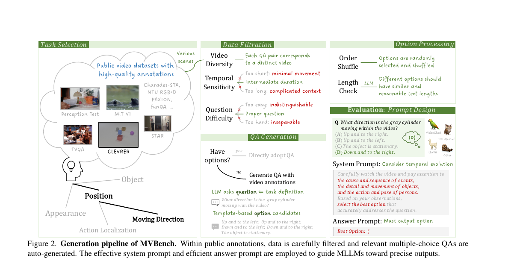

### 11. Video-MME — 时长、字幕、音频与长上下文的正交评估

- **论文**：[Video-MME: The First-Ever Comprehensive Evaluation Benchmark of Multi-modal LLMs in Video Analysis](https://arxiv.org/abs/2405.21075)，2024-05-31，arXiv 预印本；[官方项目页](https://video-mme.github.io/)。
- **定位**：用于防止把字幕或音频收益误归因于 motion encoder，也用于测长视频退化。
- **构造方法**：900 个 YouTube 视频，覆盖 6 大域、30 个子类；短视频 <2 分钟、中视频 4–15 分钟、长视频 30–60 分钟。每视频 3 道四选一题，共 2,700 QA；744 个视频有字幕，全部有音频。另一位标注者复核，且用 Gemini 1.5 Pro 文本 only 过滤可由题面直接回答的题。
- **重要设计**：报告 frames only、frames+subtitles、frames+audio；引入 certificate length，估计人类验证答案所需的最小视频片段。短/中/长 median certificate length 分别为 26.0、164.7、890.7 秒。
- **关键结果**：论文当时 Gemini 1.5 Pro frames-only 总体 75.0，+字幕 81.3，+音频 79.4；长视频从 67.4 提升到字幕 77.4。随着时长增加，开源和闭源模型普遍下降；计数、动作识别、时间感知是明显瓶颈。
- **限制**：YouTube 数据会发生链接/版权/内容漂移；不同模型可输入帧数不一致；字幕并非纯辅助，可能直接包含答案；长视频集的任务难度分布也更高，因此时长下降并非单一因果。
- **对 MotionLLM 的 know-how**：
  - 固定同一模型、同一帧采样，分别测 `M only / V only / VM / VM+text metadata`，不要跨设置比较不同输入预算。
  - 把“模型看到的帧时间戳、有效帧密度、motion token 数”写入每条 prediction manifest。
  - 对字幕/文字题单独打标签；任何字幕增益不得写成 motion representation 增益。
- **建议实验**：按动作持续时间和关键证据跨度分桶；报告 accuracy 随有效采样密度和证据跨度的曲线。
- **主图**：Figure 1，PDF 第 2 页，Video-MME 多模态、长时长案例总览。网页资产：`assets/figures/rl_video_mme.png`。来源：[原始 PDF](https://arxiv.org/pdf/2405.21075)。

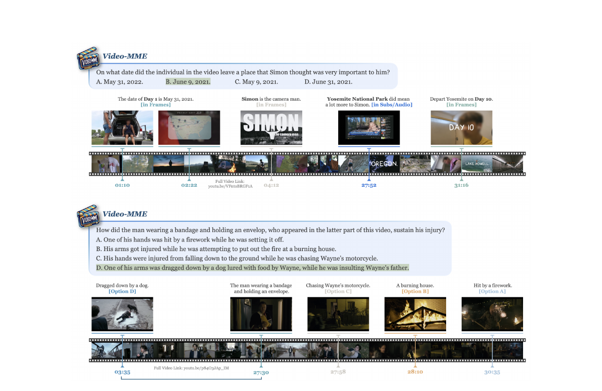

### 12. MMStar — 视觉依赖、无视觉命中与泄漏诊断

- **论文**：[MMStar: Are We on the Right Way for Evaluating Large Vision-Language Models?](https://arxiv.org/abs/2403.20330)，2024-03-29，arXiv 预印本；[官方项目页](https://mmstar-benchmark.github.io/)。
- **定位**：给 MotionLLM 的“没有运动输入也能答对吗”和数据泄漏问题提供量化框架。
- **问题发现**：GeminiPro 在不输入图像时可在 MMMU 得到 42.9%；论文统计 6 个 benchmark 上，它比随机基线平均高 24 个点以上，说明很多题不需要视觉或存在泄漏。
- **数据构造**：先从多个 benchmark 收集 22,401 条，由 8 个大 LLM 以 text-only 检查；只保留最多 2 个 inspector 命中的题，粗筛到 11,607；再由 3 位专家检查视觉依赖、能力覆盖和难度，最终人工选 1,500 条，覆盖 6 大能力、18 个细分轴。
- **指标**：令 `S_v` 为有视觉的 LVLM 分数、`S_wv` 为同一 LVLM 无视觉分数、`S_t` 为其语言基座分数：`MG=S_v-S_wv` 表示多模态增益，`ML=max(0,S_wv-S_t)` 表示多模态训练阶段的潜在泄漏。
- **关键结果**：MMStar 上 LLM 接近随机；高分辨率 GPT-4V 平均 57.1，仍低于 60。跨 benchmark 统计中，MMStar 的平均 ML 最低（1.9）。
- **限制**：无视觉命中只是泄漏/题面偏差的代理，不能证明具体样本被训练过；来自旧 benchmark 的样本仍可能被后续训练集收录；MG/ML 对 base model 对齐和 prompt 非常敏感；论文也因此计划建设动态在线集。
- **对 MotionLLM 的 know-how**：
  - 对同一 fresh artifact 同时运行 VM、V-only、M-only、question-only；把 `VM - max(V,M,text)` 作为“联合模态增益”的诊断，而不是替代主准确率。
  - 保存 sample hash、源视频 hash、motion 序列 hash、规范化题面 hash；按 group/media/source 去重并生成 contamination manifest。
  - 做选项置换：语义答案不变而字母位置变化；若表现大幅波动，说明答案位置/模板偏差而非理解。
- **建议实验**：新评估批次先跑 question-only 和 option-shuffle 筛查，命中异常样本进入隔离表，不进入主结果；保留原因和可复核证据。
- **主图**：Figure 4，PDF 第 8 页，22,401→11,607→1,500 的筛选与数据来源。网页资产：`assets/figures/rl_mmstar.png`。来源：[原始 PDF](https://arxiv.org/pdf/2403.20330)。

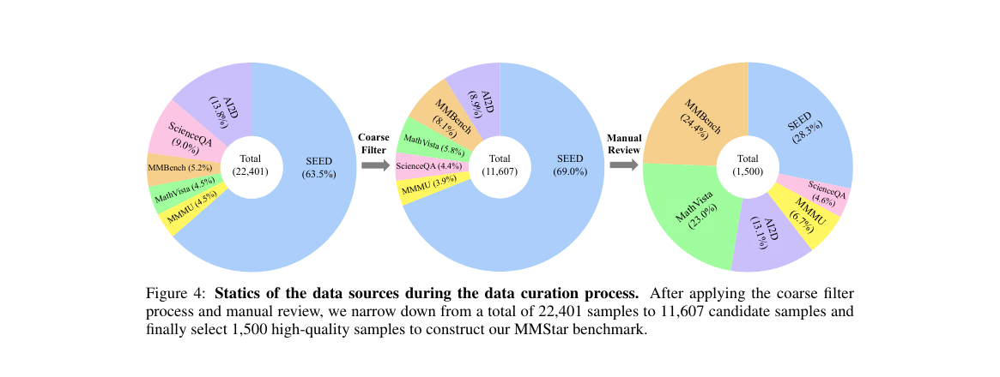

---

## 跨论文综合：给 MotionLLM 的推荐架构

### A. 训练流水线

1. **Fresh SFT barrier**：每个 registry 模型为本批次生成新的 SFT/finetune artifact；所有模型完成或正式阻塞后，才能开始 eval。
2. **Reward CI**：在真实 RL 前运行 reward 红队单测和严格 parser 单测。
3. **可验证 RL**：MCQ exact+strict format 为基础，加入有序/打乱/反转的 temporal counterfactual；每个分量独立记录。
4. **有效组采样**：按历史成功率进入 challenge band，必要时启用版本化 SSR；监测有效组率与动作类别覆盖。
5. **开放任务分支**：rubric 数据先做 SFT/pairwise preference；judge 达到人类校准门槛后，才作为辅助奖励。
6. **PRM 诊断**：先做人标 process set，PRM 只用于错误定位/BoN；验证充分后再讨论在线 RL。

### B. 评估矩阵

每个模型至少产出以下同源矩阵，且都来自本批 fresh artifact：

| 轴 | 设置 | 能回答什么问题 |
|---|---|---|
| 模态 | VM / V-only / M-only / text-only | 提升来自哪个输入 |
| 时间反事实 | ordered / shuffled / reversed / key-frame removed | 是否真的利用动作顺序 |
| 选项稳健性 | 原选项 / 位置置换 | 是否依赖字母与模板 |
| 任务切片 | sequence / count / state / pose / interaction / counterfactual | 哪类运动能力改变 |
| 时长与密度 | 短中长 / 帧密度 / motion-token 数 | 长上下文和采样瓶颈 |
| 输出合同 | strict tag / malformed / multi-answer | parser 与格式投机 |
| 开放质量 | rubric 分项 + pairwise + 人类抽检 | 解释、证据、幻觉是否改善 |

主表只放预注册的 strict generative accuracy 与当前批次合法指标；forced-choice option score、旧预测、旧准确率、proxy AGCN/MotionCLIP 结果只能放诊断附录。

### C. 最小日志与 manifest

每条 prediction 建议至少保存：`batch_id`、`fresh_artifact_id`、模型与 tokenizer hash、样本/视频/motion/题面 hash、输入模态、帧索引与时间戳、motion-token 长度、选项置换映射、原始输出、strict parse 结果、各 reward 分量、judge/rubric 版本、随机种子、运行配置 hash。这样才能复核“训练提升”是否其实来自 parser、数据重叠或输入预算变化。

## 延伸阅读（未列入 12 篇核心）

- [RLAIF-V](https://arxiv.org/abs/2405.17220)：把回答拆成原子事实问句，再做 divide-and-conquer 可信度判断；适合扩展当前 hallucination/source contradiction rubric。
- [WildVision](https://arxiv.org/abs/2406.11069)：Arena 收集真实人类偏好，并用动态隐藏集降低污染；其 GPT judge 在 tie 上一致性偏低，适合作为“judge 不能只看总体相关系数”的警示。

## 图像版权与网页使用说明

上述图片均从对应论文官方 arXiv PDF 渲染裁取，网页应在图下保留“论文名、Figure 编号、PDF 页码、原始论文链接”，不得暗示为 MotionLLM 自制图。若公开部署网页，应同时遵循论文/项目页标注的许可；当前资产优先用于项目内部研究阅读。
